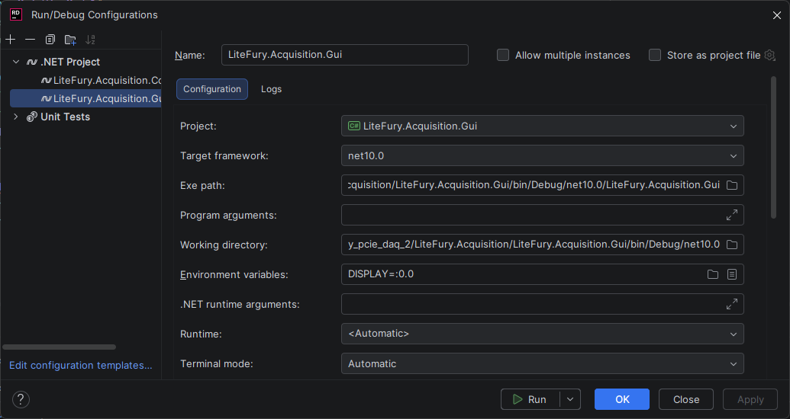

to run directly in rider with play button we need to make some udev rules
/dev/xdma0_* belongs by default to root

### 1. Create a new rule file:

`sudo nano /etc/udev/rules.d/99-xdma.rules`

### 2. 99-xdma.rules Content:**
    
`KERNEL=="xdma*", MODE="0666"`

### 3. Read new rule file and Reload new Rules:**

`sudo udevadm control --reload-rules`

`sudo udevadm trigger`

### 4. Verify:
`ls -l /dev/xdma0_c2h_0`

Should return `crw-rw-rw-` instead of `crw-------`

`crw-rw-rw- 1 root root 235, 36 Aug 28 15:20 /dev/xdma0_c2h_0`

[https://docs.oracle.com/en/operating-systems/oracle-linux/8/udev/udev-AboutudevRules.html
]((https://linux.die.net/man/8/udev))[https://linux.die.net/man/8/udev]((https://linux.die.net/man/8/udev))

---------------------------------------------------------------------

To run the GUI on the remote Linux target monitor via JetBrains Rider SSH, you need to configure the DISPLAY environment variable.

Check your current display value in the remote Linux terminal:

`echo $DISPLAY`

(Usually returns :0 or :0.0)

Set DISPLAY=:0.0 in your Rider Run/Debug Configuration:

