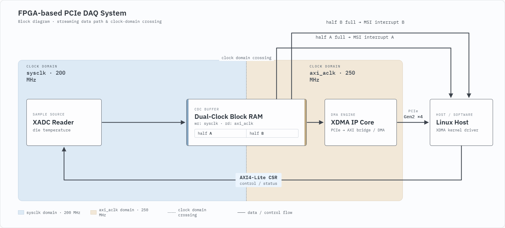

# LiteFury PCIe DAQ 2

A PCIe data acquisition design for the **LiteFury** board (Xilinx Artix-7
`xc7a100tfgg484-2`, M.2 2280 Key-M), written in **VHDL**, with simple host
applications to go with it.

The FPGA samples the on-chip temperature sensor, stores the samples in on-chip
Block RAM, and a Linux host reads them out over PCIe with the Xilinx XDMA driver.
Control and status go through a custom AXI4-Lite register block. The buffer is
split in two halves, and each half raises its own MSI interrupt when it fills up.

That makes it a real world signal, not a generated pattern. The Artix-7 has a
temperature sensor diode sitting on the die, so I used that instead of building
an external circuit into my test PC.

This is the follow-up to
[litefury_pcie_daq](https://github.com/sanfour2011/litefury_pcie_daq). That one
stopped sampling while the host read the buffer. This one does not.

The interesting part of a DAQ card is not the math. It is the data path. So the
math here is one temperature reading. Everything else got the attention.

---

## Current state



* **Signal source.** The on-chip XADC, single channel, die temperature, read over
  DRP. Real data instead of a counter. Nothing to solder. It runs on the onboard
  oscillator, not on the PCIe clock, like a real DAQ card with its own sampling
  clock.
* **Ping-pong buffer.** Dual-clock Block RAM, split in the middle. One half fills
  while the other one is read. Port B is written in the `sysclk` domain, port A
  is read by the host in the `axi_aclk` domain, and the dual-clock BRAM *is* the
  clock domain crossing for the data path.
* **CSR.** A custom AXI4-Lite slave (`AXI_CSR`) with control and status
  registers, reachable from the host through a BAR. Both interrupt pending bits
  are write-1-to-clear.
* **Interrupts.** Two separate MSI channels, one per half. The card raises
  `usr_irq_req`, waits for the acknowledge from the XDMA core, then waits for the
  host to clear the pending bit. Until it is cleared, that half stays
  write-protected. The host always reads a buffer that is standing still.

Sample rate and averaging are set in the XADC wizard, so look there for the
current numbers. Either way a half fills up fast. Too fast to poke at by hand,
which is exactly why the interrupt path had to be right before any of this became
useful.

### Reading the LEDs

The four onboard LEDs are a heartbeat. They tell you which state the card is in
without attaching a debugger:

* **All four blinking together, once per second.** Idle. Acquisition is not
  enabled and the card waits for the host to set the enable bit.
* **Counting up in binary, once per second.** Acquisition is running. The pattern
  is a 4-bit counter, so it walks through 0, 1, 2, 3 and so on.

If the LEDs are frozen in either mode, something earlier in the chain is stuck
(clock, reset, or the state machine).

## What it does not do yet

Being explicit, so you know what you are getting:

* The buffer sits in BRAM, not in DDR3, so there is not much room in it.
* No external analog input. The XADC sits on the die. Handy, and also the reason
  the signal is not very exciting. Wiring something in from outside is possible
  through the `VP`/`VN` pins, but the XADC input range tops out at 1 V
  differential, so any real world signal needs a small circuit to bring the voltage down
  to that range first.
* No counter for how often both halves filled up at once. `BUFFER_FULL` tells you
  it happened. Not how often.

---

## Requirements

**Hardware**

* LiteFury board in an M.2 Key-M slot with PCIe lanes wired up. SATA-only slots
  will not work.
* JTAG programmer to upload the bitstream file

**FPGA toolchain**

* Vivado 2025.2. Older versions will probably work, but they were not tested.

**Host**

* Linux, developed on Xubuntu. You need root to load the driver.
* The Xilinx XDMA kernel driver, see step 1 below. It is not part of this repo,
  you build and install it yourself. It has to be built for two user interrupts.
* `libncurses-dev` for the TUI, .NET SDK 10 for the GUI. You only need the one
  you plan to use.

---

## Building the FPGA design

> **Read this first.** After a fresh `git clone` the project will not synthesize
> right away, and the error does not tell you why. Generated files are left out
> of the repo on purpose, so you have to build them once yourself.

1. Open `fpga/litefury_pcie_daq_2.xpr` in Vivado.
2. In the **Sources** panel, right-click `design_1.bd` and choose
   **Generate Output Products...**. Leave the defaults (*Out of context per IP*)
   and click **Generate**. This takes a few minutes.
3. Still on `design_1.bd`, right-click and choose **Create HDL Wrapper...** if
   the wrapper is missing.
4. Run **Generate Bitstream**.

If you skip step 2, synthesis fails with this:

```
[DRC INBB-3] Black Box Instances: Cell 'block_design_inst' of type
'design_1_wrapper' has undefined contents and is considered a black box.
```

It only means the output products for the block design were never built on your
machine. Go back to step 2.

---

## Running it

### 1. Load the XDMA driver:

The driver is not in this repo. Get it from
[Xilinx/dma_ip_drivers](https://github.com/Xilinx/dma_ip_drivers/tree/master/XDMA/linux-kernel),
build it, and make sure it is built for two user interrupts. Then:

```bash
sudo insmod xdma.ko
```

Or press `l` inside the TUI, which does the same thing.

### 2. Verify device creation and PCIe link status:

a) Check that the XDMA character devices were created:

```bash
ls -l /dev/xdma0_*
```

You should see two event devices, `xdma0_events_0` and `xdma0_events_1`, one per
buffer half. If only one shows up, the driver was built for a single user
interrupt.

b) Verify PCIe link configuration:

```bash
sudo lspci -vvn -d 10ee:
```

>**Note:** Look for `LnkSta: Speed 5GT/s, Width x4` in the output. Fewer
> lanes or a lower speed means your slot or your host adapter is the limit, not
> this design.

### 3. Watch it from the terminal:

```bash
cd host_app/tui
make
./litefury-tui2
```

Press `1` to start, then `a` for auto clear, and the buffer halves scroll past
on their own. See [the TUI README](host_app/tui) for the rest of the keys.

If CTRL and STATUS both show `0xFFFFFFFF`, the driver is not loaded, or the FPGA
needs flashing again after a reboot.

### 4. Or watch it as a chart:

```bash
cd host_app/gui
dotnet run --project LiteFury.Acquisition.Gui
```

Same board, same driver. This one turns the samples into °C and draws them
live. The [GUI README](host_app/gui) covers the udev rule you need first.

---

## Register map

Base address: BAR-mapped, see `lspci`.

> ℹ️ **Interface Note:** **BAR2** operates as an **AXI Bypass** register
> interface. Block RAM (BRAM) memory space starts at offset **`0x2000`**
> within BAR2.

---

### 1. Register Overview (BAR2 - AXI Bypass)

| Byte Offset | Register Name | Access | Description |
| :--- | :--- | :---: | :--- |
| `0x00` | **`CONTROL`** | `RW` | Acquisition control *(see bitfield breakdown below)* |
| `0x04` | **`STATUS`** | `RO / W1C` | Hardware status flags *(see bitfield breakdown below)* |
| `0x08` | *Reserved* | `RW` | Scratch register, unused by the design |
| `0x0C` | *Reserved* | `RW` | Scratch register, unused by the design |
| `0x2000` | **`BRAM_BASE`** | `RW` | Start address of Block RAM (BRAM) memory space |

---

### 2. Register Detail: `CONTROL` (`0x00`)

| Bit(s) | Field Name | Access | Default | Description |
| :---: | :--- | :---: | :---: | :--- |
| **`0`** | `ENABLE_ACQUISITION` | `RW` | `0b0` | **`1`**: Start acquisition<br>**`0`**: Stop / idle |
| **`1`** | `SOFT_RESET` | `RW` | `0b0` | **`1`**: Reset the acquisition side and the CSR |
| **`3:2`** | `XADC_AVG` | `RW` | `0b10` | XADC averaging: **`00`** = 1, **`01`** = 16 **`10`** = 64, **`11`** = 256 |
| **`31:4`** | *Reserved* | — | `0x0` | *Reserved for future use* |

> `SOFT_RESET` clears itself. Writing the bit resets every register in the
> CSR, and `CONTROL` is one of them, so the bit reads back as `0`. **Do not wait
> for it and do not write it back by hand**.

### 3. Register Detail: `STATUS` (`0x04`)

| Bit(s) | Field Name | Access | Default | Description |
| :---: | :--- | :---: | :---: | :--- |
| **`0`** | `IS_RUNNING` | `RO` | `0b0` | **`1`**: Acquisition active / running<br>**`0`**: System idle |
| **`1`** | `BUFFER_FULL` | `RO` | `0b0` | **`1`**: Both halves are ready and the host read neither in time |
| **`2`** | `IRQ_PENDING_A` | `W1C` | `0b0` | **`1`**: Half A is full and waiting *(Write `1` to clear flag)* |
| **`3`** | `IRQ_PENDING_B` | `W1C` | `0b0` | **`1`**: Half B is full and waiting *(Write `1` to clear flag)* |
| **`31:4`** | *Reserved* | — | `0x0` | *Reserved for future use, always reads as `0`* |

Clearing a pending bit is what gives that half back to the card. Read it first,
then clear it.

---

## What comes next

The buffer is the next limit. There is only so much BRAM on the chip, enough to
show that the ping-pong works and not much more, so DDR3 through the MIG is the
next step. Bigger transfers would also mean the DMA overhead stops eating most
of the time.

After that, an external analog input. The XADC is handy, but it only ever
measures the chip it lives on.

---

## Credits

* The constraints (`.xdc`) are based on
  [hdlguy/litefury_pcie](https://github.com/hdlguy/litefury_pcie), which saved
  me a lot of pin-hunting.
* Xilinx PG195 (XDMA), PG058 (Block Memory Generator), PG091 (XADC Wizard) and
  UG480 (7 Series XADC) are the references for the rest.