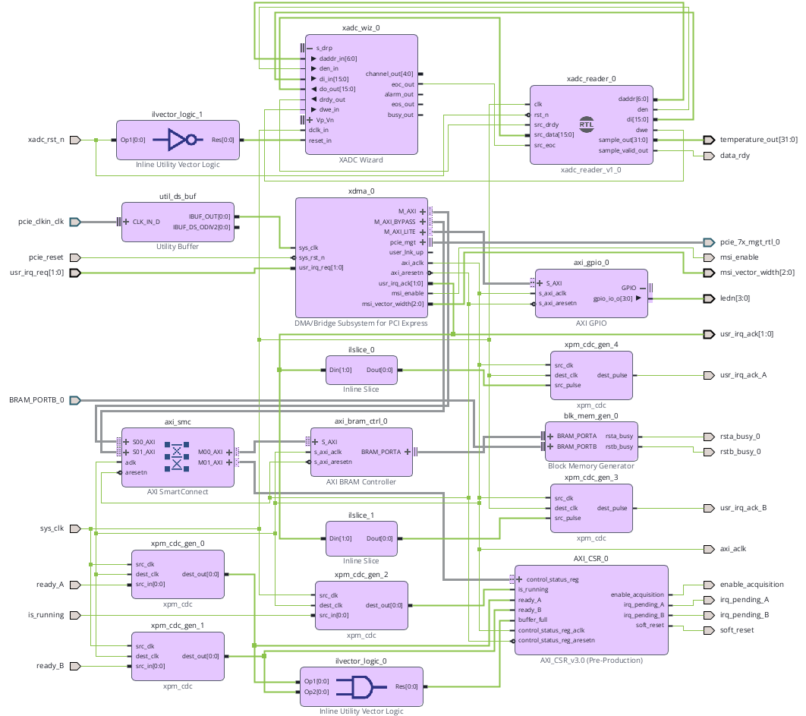
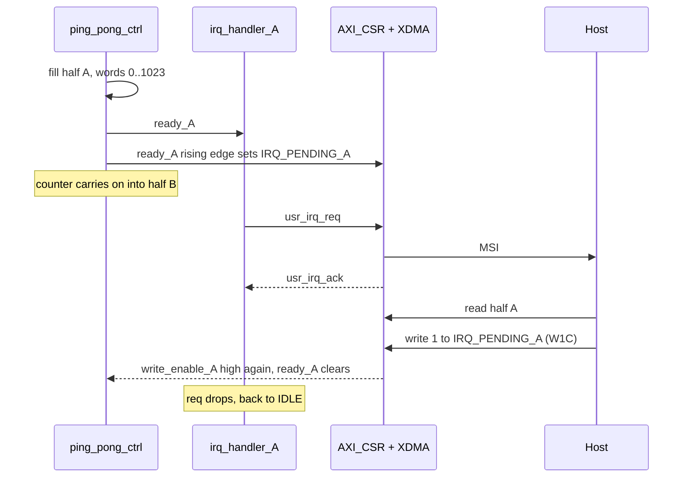

A short map of the design, entity by entity, for anyone reading the code who
was not there when it was written. Where something carries over from the first
iteration, it is marked as coming from
[litefury_pcie_daq](https://github.com/sanfour2011/litefury_pcie_daq).

The design has two parts:

* **VHDL entities** (`top_level.vhd` and below) - the autonomous side, on
  `sysclk`, that acquires and buffers samples.
* **Vivado Block Design** (`design_1.bd`) - the PCIe/host-facing side, built
  from Xilinx IP, one packaged IP of my own (`AXI_CSR`) and one hand-written
  entity pulled straight in as a module reference (`xadc_reader`).

---

## VHDL entities

### `top_level.vhd`

The top of the design. Instantiates everything below, wires the physical pins
(from the `.xdc` files) to the block design and the hand-written logic, and
owns the glue logic that did not deserve its own entity:

* **CDC (clock domain crossing) synchronizers** for the level signals that
  cross into `sysclk` (`enable_acquisition`, `soft_reset`, both
  `irq_pending`). Each is a 2-flip-flop chain with the `ASYNC_REG` attribute
  set, so the tools do not optimize the two flip-flops into one. The IRQ acks
  cross the same way round but are pulses rather than levels, and those ended
  up as `xpm_cdc` blocks in the block design instead. The block diagram had
  gotten messy enough by then that saving a few blocks was not the point
  anymore.
* **`irq_handler_A` and `irq_handler_B`** - two copies of a 3-state FSM
  (`IDLE`, `WAIT_FOR_HOST_ACK`, `WAIT_FOR_IRQ_PENDING_CLEARED`), one per
  buffer half. Each drives its own `usr_irq_req` line when its half fills,
  waits for the XDMA core to confirm the MSI was sent (`usr_irq_ack`), then
  waits for the host to clear `irq_pending` (W1C). Leaving the last state
  also requires `ready_X` to be low again, otherwise the FSM re-triggers on
  a stale ready flag.
* **Buffer ownership** - `write_enable_X <= not irq_pending_X_synced`. While
  a pending bit is set, that half cannot be written, so the host always
  reads a buffer that is standing still. One line, the whole rule.

### `tick_gen.vhd`

A generic clock divider. Given `CLK_FREQ_HZ` and `TICK_RATE_HZ`, it produces a
single-cycle `tick` pulse at the requested rate. Unchanged from
[litefury_pcie_daq](https://github.com/sanfour2011/litefury_pcie_daq), but
down to one job here: the 1 Hz LED heartbeat. The sample rate now comes from
the XADC instead.

### `acquisition_ctrl.vhd`

Owns the acquisition state: starts/stops on `acq_en` and reports
`is_running`. Much thinner than in
[litefury_pcie_daq](https://github.com/sanfour2011/litefury_pcie_daq), where
it also instantiated the sample generator and produced `buffer_full` and
`sample_idx`. It now just gates
`src_sample_valid` behind `acq_en` and passes `src_sample` through, so the
source can be swapped without touching this entity.

### `sample_gen.vhd`

The sawtooth generator from
[litefury_pcie_daq](https://github.com/sanfour2011/litefury_pcie_daq), plus a
`SAWTOOTH_MAX` generic so it wraps at a
configurable value. Not instantiated anywhere now, because the thing that
used to instantiate it was `acquisition_ctrl`. Kept in the tree: it is still
the easiest way to feed the buffer path a known pattern without the XADC.

### `xadc_reader.vhd`

Talks to the DRP (Dynamic Reconfiguration Port) side of the XADC Wizard.
Stays small, the wizard handles the actual ADC, so this basically waits for
`eoc`, pulses `den` for a cycle, waits for `drdy` and latches the top 12 bits
of the DRP word into a 32-bit sample. `daddr` is only assigned in reset,
which leaves it at 0, the temperature register.

The fourth state exists only to wait for `drdy` to fall again. Without it
`sample_valid_out` stays high and `ping_pong_ctrl` writes the same value
every clock cycle instead of once per conversion.

### `ping_pong_ctrl.vhd`

One address counter over the whole 2048-word BRAM, split at the midpoint.
Half A is words 0 to 1023, half B is 1024 to 2047, and the counter wraps back
to 0 from the end. `ready_A` goes high when the counter reaches the midpoint,
`ready_B` at the end, and each flag clears again on the rising edge of its
own write enable.

It does not decide when a half may be reused. Both write enables come in from
`top_level.vhd`, so the ownership rule lives in one place:

Half B runs the same loop one half-buffer out of phase.

---

## Vivado Block Design (`design_1.bd`)

Everything below is Xilinx IP wired together in the Block Design GUI, with two
exceptions. The XDMA configuration is carried over from
[litefury_pcie_daq](https://github.com/sanfour2011/litefury_pcie_daq)
unchanged except for one parameter, `xdma_num_usr_irq`, which goes from 1
to 2.

| IP instance | Role |
|---|---|
| `xdma_0` | Xilinx XDMA core. PCIe Gen2 x4 endpoint, handles the link and generates the MSI interrupts. `M_AXI` and `M_AXI_BYPASS` reach the CSR and the BRAM through `axi_smc`, `M_AXI_LITE` goes to `axi_gpio_0`. Now drives two `usr_irq_req` lines instead of one. |
| **`AXI_CSR_0`** | **My own IP.** The custom AXI4-Lite slave from [litefury_pcie_daq](https://github.com/sanfour2011/litefury_pcie_daq), repackaged as v3.0. Gained `SOFT_RESET` in `CONTROL` and a second write-1-to-clear pending bit in `STATUS`. It also raises those pending bits itself, on the rising edge of `ready_A` / `ready_B`. See the register map in the top-level project README for the exact bit layout. |
| **`xadc_reader_0`** | **My own RTL, but not packaged as IP.** `xadc_reader.vhd` is pulled into the block design as a module reference (**Add Module...** on the canvas), so it stays a plain source file instead of living in `ip_repo`. That is why it shows up as `module_ref` and carries the RTL badge in the diagram. |
| `xadc_wiz_0` | Xilinx XADC Wizard. Single channel on the die temperature sensor, DRP interface, 40 kSPS with 16x averaging and offset/gain calibration enabled. |
| `axi_bram_ctrl_0` | Bridges the host-facing AXI4 (byte-addressed) side of the buffer to Port A of the Block RAM. |
| `blk_mem_gen_0` | The dual-clock Block RAM itself. Port A (byte-addressed) faces the host through the BRAM controller; Port B (word-addressed) is driven directly from `top_level.vhd` by `ping_pong_ctrl`. This dual-clock BRAM is the data-path clock domain crossing. |
| `axi_smc` | AXI SmartConnect. Routes the XDMA masters to the right slave (`AXI_CSR_0`, `axi_bram_ctrl_0`) based on address. |
| `axi_gpio_0` | Drives the 4 onboard LEDs, active-low, from the host side. Same as in [litefury_pcie_daq](https://github.com/sanfour2011/litefury_pcie_daq): superseded by the `sysclk` heartbeat in `top_level.vhd`, its output is left `open` and it stays as a working AXI-GPIO reference point. |
| `util_ds_buf` | Differential clock buffer for the PCIe reference clock input. |
| `xpm_cdc_gen_0` to `_4` | The block-design half of the CDC. Three single-bit macros carry `ready_A`, `ready_B` and `is_running` into `axi_aclk`, two pulse-transfer macros carry the IRQ acks the other way. |
| `ilslice_0`, `ilslice_1` | Split `usr_irq_ack[1:0]` into its A and B bits before they cross domains. |
| `ilvector_logic_0` | AND gate feeding `buffer_full` on the CSR, from the already synchronized `ready_A` and `ready_B`. |
| `ilvector_logic_1` | Inverter on the XADC reset, the wizard wants it active high. |
