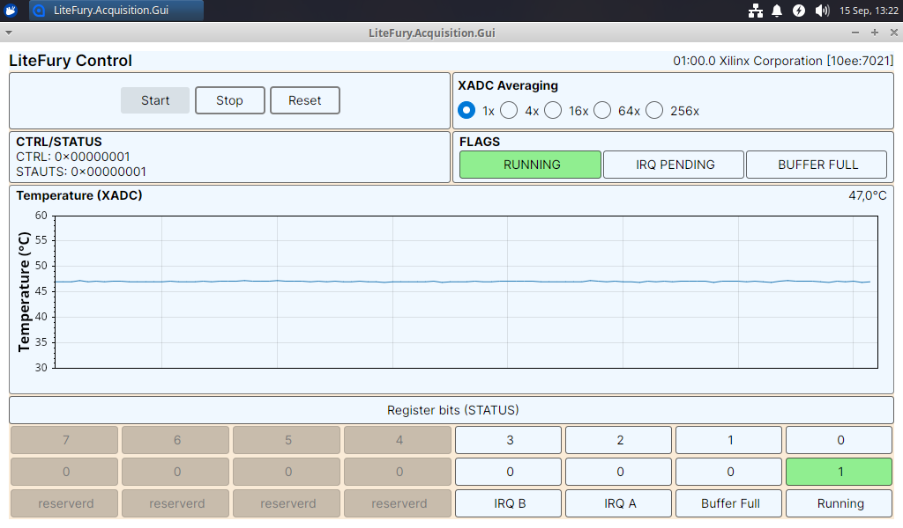

# LiteFury Acquisition GUI

Desktop app that reads die temperature from the LiteFury board and draws it as a
live chart. Same board and same driver as the TUI, but this one is built in C#
with Avalonia, so it runs on Linux and Windows from one codebase. The hardware
part sits in its own library, which means the console app and the unit tests can
use it without ever opening a window.



## Projects Overview

| Project | What it is |
|---------|------------|
| `LiteFury.Acquisition.Core` | Hardware access and math, no UI at all |
| `LiteFury.Acquisition.Gui` | Avalonia window and view models |
| `LiteFury.Acquisition.ConsoleApp` | Same Core, prints hex to the terminal (for Quick Hardware Tests) |
| `LiteFury.Acquisition.Core.Tests` | Unit tests for the math parts |

The split is the whole point. `Core` knows about `/dev/xdma0_*` and about
temperature, but it does not know that a chart exists. Everything above it is
replaceable. If you only cared about Windows, you could drop the Avalonia
project and put a WPF front end on the same Core without touching a single line
of the hardware code.

## Project structure

`AcquisitionEngine` is the piece that ties it together. It owns three small
classes:

- `Csr` reads and writes the control and status register
- `Irq` waits on the two interrupt lines
- `BramData` pulls a half buffer over DMA

When half A fills up, the board raises interrupt A. From there the engine always
runs the same four steps:

1. Wake up on the interrupt for that half.
2. Read that half over DMA.
3. Fire `SamplesReady` with the data and the channel.
4. Clear the pending bit for that half.

There is a limit in this design and it is worth knowing about. `SamplesReady` is
a plain event, so the call blocks until every subscriber is done. Your handler
has to finish before the other half fills up.

The GUI subscribes to that event and pushes the work onto the UI thread with
`Dispatcher.UIThread.Post`, which does not block the reader. Raw values go
through `TemperatureConverter`, then through `SampleAverager`, then into a
`SampleHistory` ring buffer and the ScottPlot streamer. The two register boxes
do not work that way. A timer just reads CTRL and STATUS periodically, whether
anything happened or not. The XADC averaging is set with the radio buttons and goes straight to CTRL. 
The software averaging next to it only changes the window of the moving average.

Three small classes do the actual math:

- `TemperatureConverter` turns a raw XADC word into °C. The formula and the
  magic number 503.975 come from Xilinx UG480.
- `SampleAverager` is a moving average over a sliding window. It adds the new
  value and subtracts the one that fell out, so the cost does not grow with the
  window size.
- `SampleHistory` is a ring buffer that keeps the last 512 values.

These three are also the only classes with unit tests. The hardware classes need
a real board, so there is nothing to test against on a build server.

## Setup

The GUI needs more preparation than the TUI. Three things, once each.

### 1. udev rule

`/dev/xdma0_*` belongs to root by default, so running from the IDE fails. Create
a rule file:

```bash
sudo nano /etc/udev/rules.d/99-xdma.rules
```

Content:

```
KERNEL=="xdma*", MODE="0666"
```

Reload and apply:

```bash
sudo udevadm control --reload-rules
sudo udevadm trigger
```

Check it worked:

```bash
ls -l /dev/xdma0_c2h_0
```

You want `crw-rw-rw-` instead of `crw-------`:

```
crw-rw-rw- 1 root root 235, 36 Aug 28 15:20 /dev/xdma0_c2h_0
```

See the [udev man page](https://linux.die.net/man/8/udev) if you want to know
what the rule actually does.

### 2. DISPLAY for remote runs

If you develop over SSH from Rider and want the window to open on the monitor
attached to the target machine, you have to set `DISPLAY`. Check what the target
uses:

```bash
echo $DISPLAY
```

Usually `:0` or `:0.0`. Put that value into the Run/Debug configuration:


### 3. Needed Packages

Nothing to do here if you just cloned this. Every package is already listed in
the `.csproj` files and `dotnet build` restores them. This is what the GUI
project pulls in:

| Package | What for |
|---------|----------|
| `Avalonia` | the UI framework |
| `Avalonia.Desktop` | desktop backend, the thing that opens a window |
| `Avalonia.Themes.Fluent` | default look |
| `Avalonia.Fonts.Inter` | default font |
| `AvaloniaUI.DiagnosticsSupport` | dev tooling, excluded from Release builds |
| `CommunityToolkit.Mvvm` | `[ObservableProperty]` and `[RelayCommand]` |
| `MessageBox.Avalonia` | error dialogs |
| `ScottPlot.Avalonia` | the live chart |

Versions are pinned in the `.csproj`, so look there rather than here.

The templates are only worth installing if you want to set up something similar
yourself:

```bash
dotnet new install Avalonia.Templates
```

## Build and run

```bash
dotnet build
dotnet run --project LiteFury.Acquisition.Gui
```

The console app is handy when the GUI is not the problem:

```bash
dotnet run --project LiteFury.Acquisition.ConsoleApp
```

It prints the raw words as hex, half A in red and half B in cyan, so you can see
at a glance whether both halves arrive and whether the values look sane.

Tests:

```bash
dotnet test
```

## Requirements

- .NET SDK 10, all four projects target `net10.0`
- [Xilinx XDMA kernel driver](https://github.com/Xilinx/dma_ip_drivers/tree/master/XDMA/linux-kernel)
  built and loaded, configured for two user interrupts
- The FPGA bitstream from [`fpga/`](../../fpga) flashed to the board

The PCI address is currently hardcoded in `PcieDevice.cs` as
`0000:01:00.0`. If your board shows up somewhere else in `lspci`, change it
there.