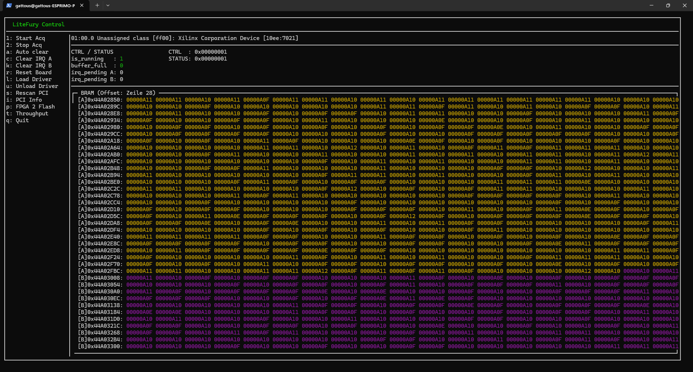

# LiteFury XDMA Monitor 2

Terminal UI for controlling and monitoring a LiteFury (Artix-7) FPGA board over PCIe/XDMA. Replaces a manual setup of several hand-arranged tmux panes with a single ncurses interface. Second iteration, rebuilt around the ping-pong buffer: two halves, two interrupt lines, two Colors.



## Use with caution

This is a lightweight terminal utility for debugging the board over SSH. It was
built to replace a hand-made tmux layout and keep the usual checks in one
place. For more controlled workflows, there are shell scripts in the first
iteration of the project, see
[`manual_scripts/`](https://github.com/sanfour2011/litefury_pcie_daq/tree/master/host_app/manual_scripts).

This is <u>**not a polished software**</u>. Error handling is minimal and
optimistic; if something goes sideways, the TUI may explain the issue in a way
that is more confusing than the underlying problem.

If you want something robust, use the scripts directly. If you want a quick
single-screen workflow that usually does the job, this is the right tool.

## Build

Needs `libncurses-dev` and `pthread`.

```bash
sudo apt install libncurses-dev
make
./litefury-tui2
```

## Layout

- **Left panel** – command list / keybindings
- **PCI Info** – `lspci` output for the board
- **CTRL / STATUS** – live register view, `irq_pending` now split into A and B
- **BRAM** – hex dump of the onboard memory, each line tagged `[A]` or `[B]`
  and coloured by half

## Keybindings

| Key | Action | What it does |
|-----|--------|---------------|
| `1` | Start Acq | Sets the "running" bit in the CTRL register |
| `2` | Stop Acq | Clears the "running" bit |
| `a` | Auto clear | Toggles automatic mode: the main loop watches both pending bits, reads whichever half just filled and clears it on its own |
| `c` | Clear IRQ A | Write-1-to-clear on the STATUS register's `IRQ_PENDING_A` bit, hands half A back to the board |
| `k` | Clear IRQ B | Same for `IRQ_PENDING_B` and half B |
| `r` | Reset Board | Writes to the board's sysfs `reset` file |
| `l` | Load Driver | `insmod xdma.ko` |
| `u` | Unload Driver | `rmmod xdma` |
| `s` | Rescan PCI | Triggers a PCI bus rescan and checks whether the device reappears |
| `i` | PCI Info | Re-runs `lspci` for the board |
| `p` | FPGA 2 Flash | Unloads the driver and resets the board to prepare it for reflashing |
| `t` | Throughput | Benchmarks BRAM read throughput (MB/s) via repeated DMA reads (`pread()` on the XDMA `/dev/xdma0_c2h_0` device) |
| `q` | Quit | Exits the program |

`c` and `k` only do something while auto clear is off. With it on, the loop is
already doing the clearing and the keys stay out of the way.

## Structure

```
main.c          entry point, ncurses setup, main loop
shell_exec.c/h  runs one-shot shell commands without corrupting the ncurses screen
FPGA/           hardware access - registers, BRAM, IRQ threads (no ncurses dependency)
ui/             drawing only - one file per panel, takes a WINDOW* and some data
```

The FPGA/ modules talk to the real board, over two different paths. Registers go through the AXI bypass BAR: /dev/xdma0_bypass is mmap'd and CONTROL and STATUS (CSR) are read and written in place. That device has no DMA engine attached, so pread()/pwrite() and mmap is the only way in/out. The BRAM dump takes the other route and uses pread() on /dev/xdma0_c2h_0, where the DMA engine moves the data, and it now reads half a buffer at a time, either from the base address or from the midpoint.

The IRQ side runs on its own pthread, because waiting for an interrupt is a blocking read() on the event device and would stall the UI loop if it shared a thread with it. There are two of those threads now, one on /dev/xdma0_events_0 for half A and one on /dev/xdma0_events_1 for half B. Each thread blocks on a semaphore after its read, and the main loop posts that semaphore once it has cleared the matching pending bit, so a thread cannot run ahead of the half it is waiting on.

## Requirements

- [Xilinx XDMA kernel driver](https://github.com/Xilinx/dma_ip_drivers/tree/master/XDMA/linux-kernel) (BSD-licensed) built and loaded (`xdma.ko`), configured for two user interrupts
- [Xilinx Vivado](https://www.xilinx.com/support/download.html) to build and flash the FPGA firmware itself

The driver exposes character devices (`/dev/xdma0_c2h_0`, `/dev/xdma0_events_0`, ...) with non-standard semantics - a plain `pread()`/`pwrite()` on these doesn't behave like a regular file, the offset addresses FPGA memory instead. See the driver repo for details before using them directly.
